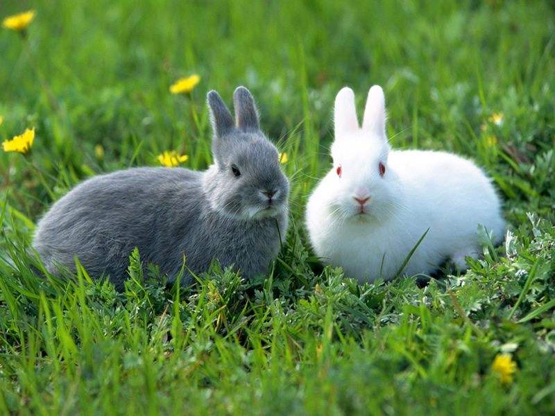
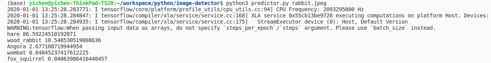

# Image predictor

Image predictor CLI using DenseNet/inception V3

## Getting Started

```
python3 predictor.py rabbit.jpeg tiger.jpg
```

### Prerequisites

- pip 3.5.1 (and later versions)
- Tensorflow 1.4.0
- openCV
- Keras 2.x
- imageai

### Installing

- Install tensorflow, keras, opencv

```
pip install -U tensorflow keras opencv-python
```

- Install imageai

```
pip3 install imageai --upgrade
```

### Image Prediction




